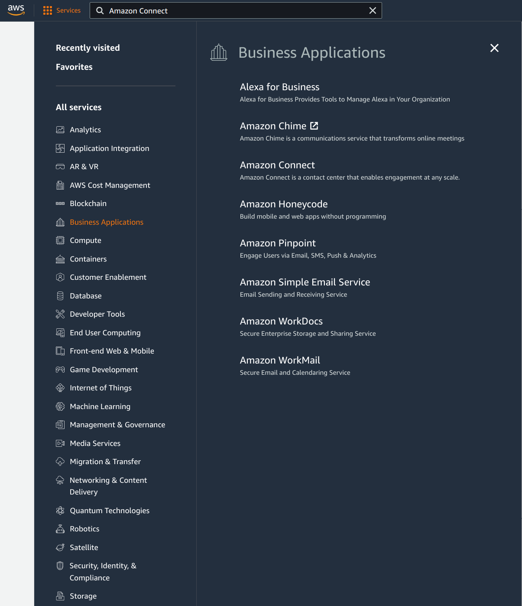
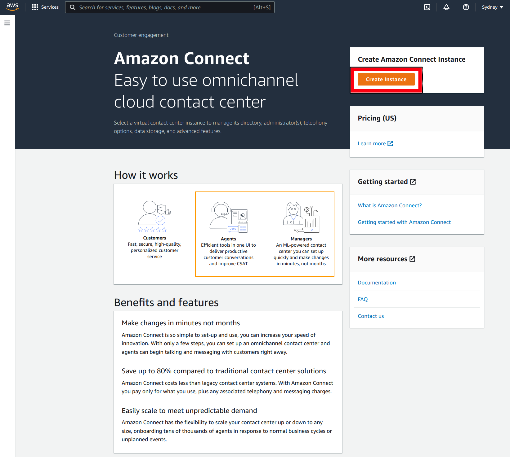
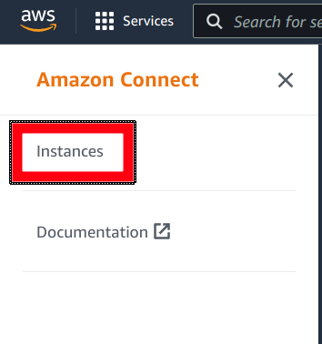
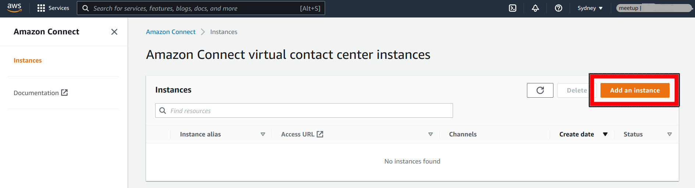
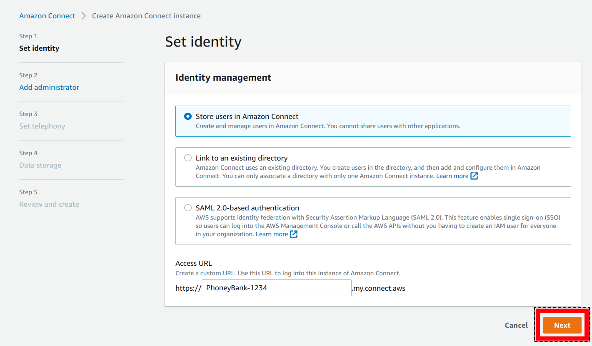
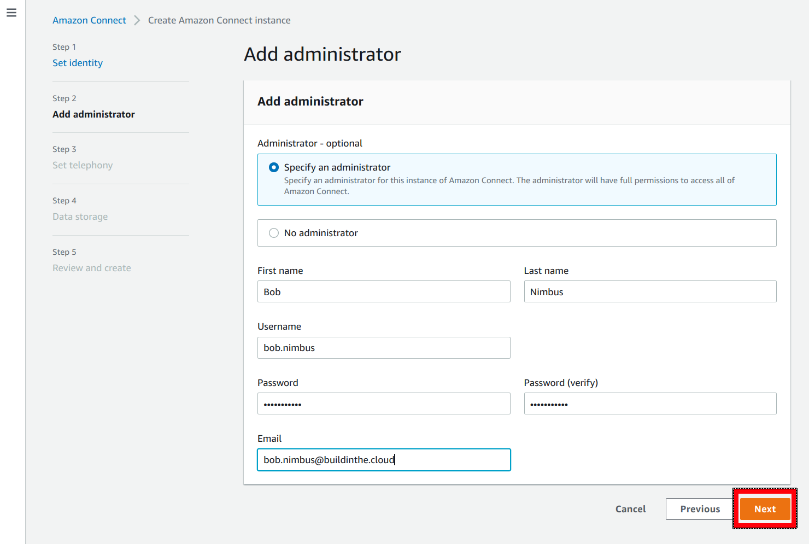
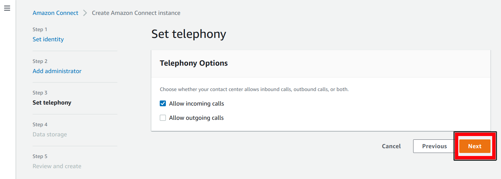
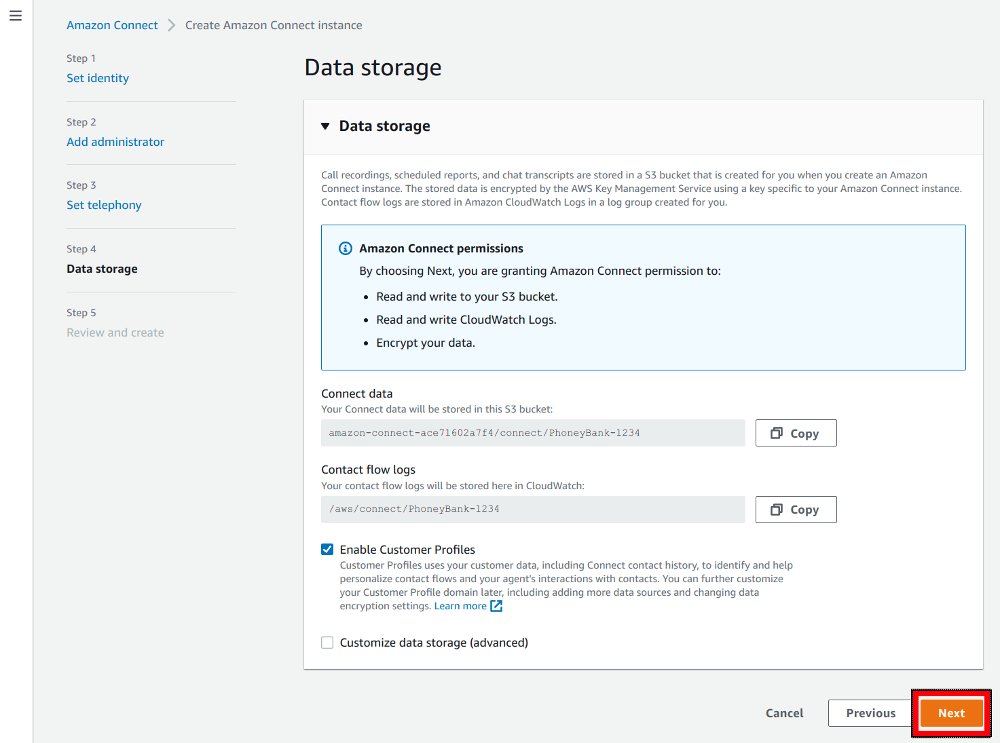
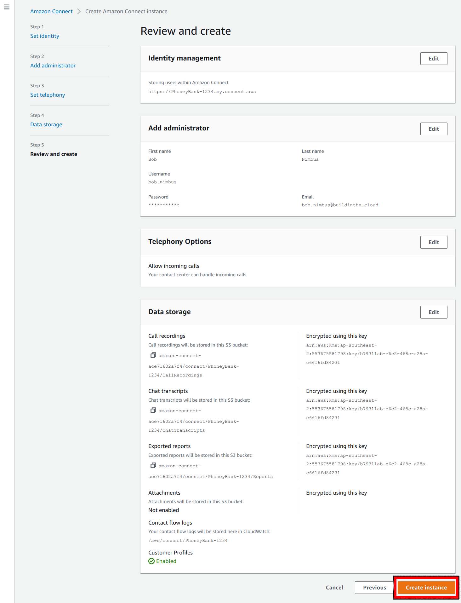
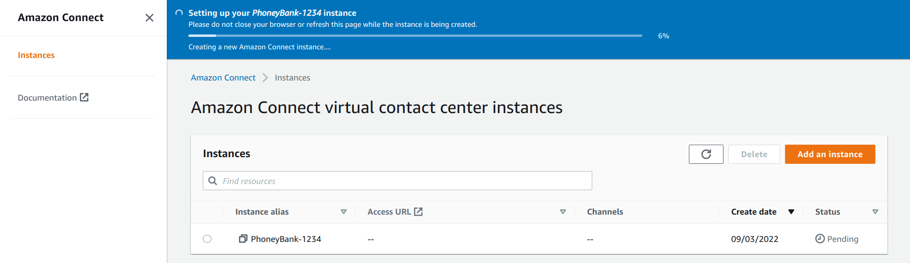

# Setting up your First Amazon Connect Instance
## Introduction
As discussed in the previous section, the first thing we are going to need to do is to create Phoney Bank an Amazon Connect Instance that we can leverage for our customers to call into.

### Create a new Connect Instance

#### New Instance Wizard
In a new AWS account, we are going to want to select the "Amazon Connect" service from the service menu located in the top left of the AWS Management Console... as shown in the below screenshot. You can also open it directly be browsing to https://console.aws.amazon.com/connect/v2/app/home.

Making sure we are in the "Sydney" region (Phoney bank are located in Australia after all) we are going to want to click on "Create Instance" from the dashboard.

If for some reason you don't find yourself on the Amazon Connect Dashboard page, you can also create a new instance by browsing to the "Instances" menu (located in the left hand menu... possibly hidden by a hamburger button)

and then clicking on "Add an instance" from the Instances panel.

#### Creating a new Instance
Regardless of how you started the "Create Amazon Connect instance" wizard, the first thing we need to do is select an "Identity Management" solution.

We have three options:
1. Firstly, we can have Amazon Connect store user details (those people who need to interact with Connect such as Admins and agents) within the Amazon Connect instance itself. This is the simplest solution and the one we'll be going with for today as it's the quickest to setup.
 2. The second option is to link our new Amazon Connect instance to an existing AWS Directory Service directory. This is helpful if you've already deployed a directory for centralising user identity and wish to extend it into your Amazon Connect Instance. This wouldn't make a lot of sense for us as we'll only have the one application to authenticate against.
  3. We can configure Amazon Connect to authenticate our users against a SAML 2.0-based authentication endpoint. This is great if you want to provide your users with a single sign-on style experience and is the most flexible and expandable solution of the three. However it's also the most complex and time consuming to setup.

 For our use case we need to make sure that "Store users in Amazon Connect" is selected and we need to give our instance an alias. This name needs to be unique so we'll go ahead and use "PhoneyBank-1234" for the example. For anybody following along you'll need to select your own random number other than 1234.

 Once you've entered your instance alias, you can go ahead and click "Next"

 

 Next, we need to provide some details for an administrator user. This user will have full access to the admin console for the Amazon Connect Instance. We can simply go ahead and enter our details and click "Next" once we're done

 

 Next, we need to configure our Telephony Options. For the moment we only need our Connect Instance to be able to receive phone calls, so we can go ahead and uncheck the "Allow outgoing calls" check box and click "Next" (we can change this option later via the management console.

 

 Step 4 is all about configuring the "Data Storage" that the instance will use. Recent changes to the Wizard have streamlined this stage of the wizard a lot, to the point where we can simply accept the default and click "Next"

 

Finally we can "Review and create" our instance. Simply double check that all of the settings are correct and click the "Create Instance" button at the bottom of the page.

From the "Instance" page we can see that our new instance is being created and will take about a minute or two to complete. NOTE the "please do not close your browser or refresh this page while the instance is being created" call out above the progress bar.

And after a few moments you should get the "Success" notification staying that "Your instance has been created".

## Conclusion
And that it... In this section we've gone ahead an created an Amazon Connect Instance that we can use throughout the rest of the workshop. We've configured it to store user identities locally, which has reduced the operational complexity of the solution. And we've had the wizard setup some basic data storage options including some S3 buckets that we'll be able to use later.

With all of this in place we can now move onto the next set of tasks which involve building out our first Contact flow so that we can start accepting phone calls.

Proceed to the next section [here](Part2.md)