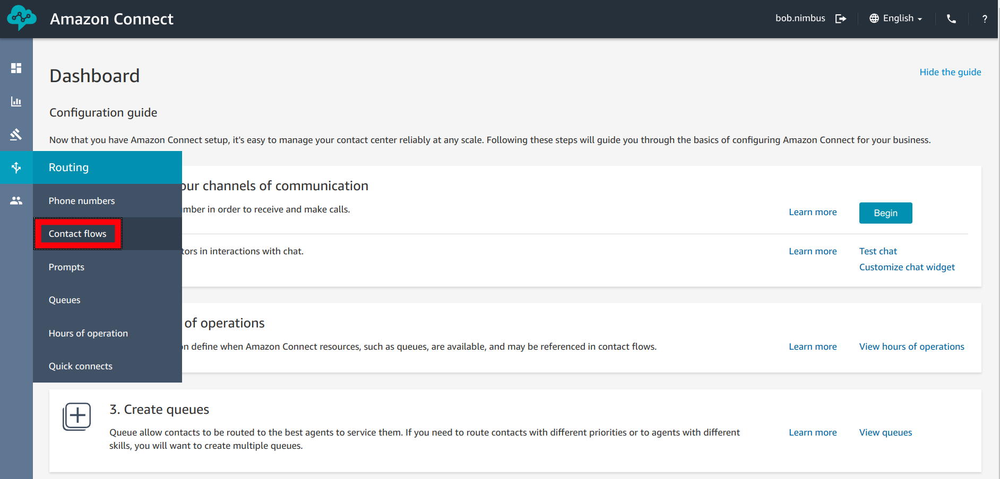

# Accepting our First phone Call
## Introduction
We have an Amazon Connect instance, and it's got it's administrator setup and ready to go... but we don't actually have anything for our customers to call yet. That what we'll fix in this section... setting up a phone number for our customers to call and a contact flow that Connect can run our callers through.

We'll start by building out a very simple Contact Flow which simply answers the phone, waits 2 seconds and then plays a message to the caller. It's not a very useful contact flow, but it will let us test our system and confirm that everything is working correctly.

Once we've built our contact flow, we can go ahead and provision a phone number. When doing so, we can link the phone number to our contact flow so that every time somebody rings the number it triggers our flow. At this point we'll be able to test our handy work and ring into the Connect instance to hear our message.

## Building a basic Contact Flow
picking up from where we left off in the last section, we should be presented with a list of all of our Amazon Connect Instances (of which we only have one). In this list we want to click on the "Access URL" for our instance which will take us to our Instance's admin portal.

When we click on the link we should be presented with an "Amazon Connect" login page. We can go ahead and login using the credentials we provided in the previous section.

Once we're logged in we are presented with the "Configuration Guide" which suggests a number of tasks that we should complete. We'll come back to most of these in the following sections, but for now we actually want to browse to the "Routing" section (located in the left hand menu" and select "Contact Flows"

We should now be presented with the "Contact Flows and Flow Modules" page where we can choose to create a new Contact Flow" by clicking the "Create contact flow" button on the top right of the page. Note: make sure not to accidentally select a different flow type from the drop down located ext to this button.

On the "Contact Flow" design page we are presented with a page not too dissimilar from draw.io or Microsoft Visio. The main premise here is that we want to drag object from the left hand menu, onto the design surface and draw links between each step. We can already see that Amazon Connect has given us a start point, so now it's just up to use to decide what we want to have happen once the call is answered.

Seeing as all we want to do right now is validate our instance is working, we really only need it to do three things:
1. Wait 2 seconds once it answered (nobody ever starts talking the second a call is connected)
2. Play a message of some kind
3. Hang up the call

Each of these actions can be represented by a "Block" that we can drag across from the left hand menu:
1. We can make the call wait by using a "Wait" "Block" which can be found under "Branch"
2. Playing a message can be done by the "Play Prompt" "Block" found under "Interact" menu
3. To hang up the call we can use the "Disconnect" block found under the "Terminate/Transfer" menu

To leverage each of these blocks we simply need to drag and drop them onto the design surface of the contact flow like what's shown below

Now, this has just put these block into the contact flow... the next thing we need to do is to link them all together to make a continuous "Flow" between each block. You will notice on each block there are a number of states ("Start", "Time Expired", "Error" etc) and a little circle next to each one. These are the possible outcomes of that block and every outcome within a contact flow must be link to something else.

Walking through our example, when somebody calls in... it starts at the "Entry Point" with the only state being "Start". if you click on the circle next to Start you can drag it to the circle on the left hand side of the "Wait" block". Release the mouse button and you should have created a link between the two blocks like what's shown below:

Next we need to link up the two possible states from our "Wait" block. First, when the time expires, we want the call to proceed to the "Play Prompt" block and if there is an error, the we simply want the system to disconnect the call. TO do this, we can drop a connection between the "Time Expired" state and the "Play Prompt" block... and a second link between "Error" and the "Disconnect" block.

And finally, we need a link between the "Okay" state of the "Play Prompt" to the "Disconnect" block (notice you can have multiple paths leading to the same point).

Before we go ahead and save our work, click on the title of the "Wait" block to open it's properties window. Here we can set how long we want it to wait before triggering the "Time Expired" state. For our example, we want it to wait 2 seconds. Click "Save" once complete.

Opening the Properties for the "Play Prompt" block (again, by simply clicking on the title of the Block) we can select "Text to speech or chat text" and enter a simple message that will be read back to the caller. Just like before, click "Save" once you done.

Finally, to complete the creation of a basic contact flow we need to give our Contact Flow a name... which for this example will be "Initial Flow" at which point the "Save" button will illuminate and we can click to save our work.

You'd think that the Flow is now ready to be used in other areas of our Connect Instance, but you'd be wrong. Before we can consume our Contact Flow, we need to publish it. Go ahead and click the "Publish" button located just to the left of the "Save" button.

Next you'll be prompted with a warning message asking if you're sure you want to publish the Contact Flow. We can simply go ahead and click "Publish".

And now we're done and ready to proceed. Our next step is to link it to an incoming phone number so we can actually consume it and start receiving phone calls.

## Provisioning Phone Number and Mapping Contact Flow
With our Initial Contact Flow created, our next step is to provision an incoming phone number and link the two together.

First step is to browse to the "Phone Numbers" page which can be found under the routing tab on the menu on the left hand side of the page. 

Next, we want to claim a number. We can do this by clicking the "Claim a number" button on the right hand side of the page (I know right, clicking claim a number to claim a number...)

For our customers lets create a Toll-Free number that they can call. So what we can do is select Australia from the drop-down menu and after a moment, AWS will propose a number of options for us to select from. We can request certain prefixes if we want, but for our purposes we can just go ahead and select a number from the list.

Once we've selected a number that we like, the final step is to select our "Initial Flow" contact from from the drop-down at the bottom of the page and then click "Save".

You'll receive a message stating that the phone number is being claimed for you. Do not refresh the page as this should only take a couple of moments.

After a few moments you should be redirected back to the "Manage Phone numbers" page with your new phone number listed along with the Contact Flow it's pointing to. At this point you should be able to ring that phone number and listen to the message being played back to you.

## Conclusion
At this stage we have confirmed that our new Amazon Connect Instance is:
1. Functioning as we expected
2. Has a phone number we can dial into 
3. Points to our "Initial Flow" Contact Flow

While we are still not quite in a position to be able to help our customers, we have validated all of the core components of our new contact centre solution. In the next section we'll go through the process of adding queues to our Contact flow and allowing customer support Agents to field incoming calls.

Proceed to the next section [here](Part3.md)