# Adding Queues and Agents to our Contact Flow
## Introduction
In our last section we got our first Contact Flow attached to an incoming 1800 number and started being able to accept incoming phone calls. In this section we'll take our Contact Flow a little further and get these incoming calls landing on the phones of our customer support agents.

To get this working as we'd expect, there are a number of things we are going to need to configure including queues, opening hours, agent permissions and the Agent Control Panel.

By the end of this section we should be able to call our 1800 number (the one we provisioned in the last section) and get directed to a human agent who can help us with our enquiry.

## Setting up the prerequisites for Queues
Amazon Connect Queues are the mechanism that we can use to allow our support agents to communicate with each of the callers. In order to leverage queues we need to setup a number of prerequisite tasks

### Hours of Operation
This first prerequisite is to setup the hours that the queue will be in operation. If we think about normal support numbers they are typically not open 24 hours a day and we will want to ability to handle calls differently depending on Wether the queue is open or closed.

So we need to setup some hours of operations that we can assign to our new Queue. to do this we need to browse to the "Hours of Operations" page, under "Routing" found on the Left hand menu as shown below:

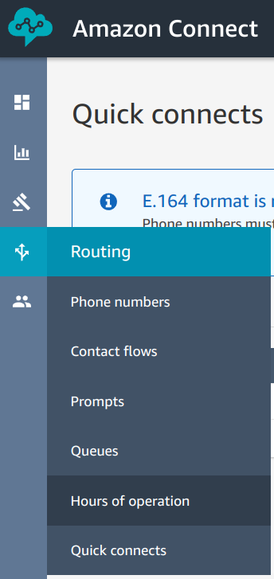

We want to have different hours of operations for each of our queues so we'll create a new set of hours by clicking the "Add new hours" button on the top right of the page

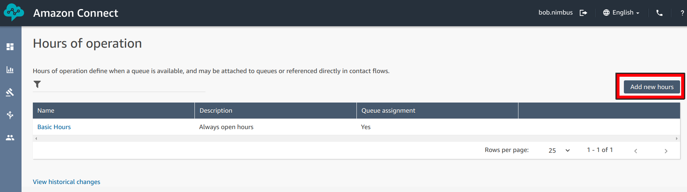

For our name we can call it "Standard Support" (as this will be the hours of operations for our support queue), we need to set our Time zone to "Australia/Melbourne" and we'll set our hours to 9:00am to 9:00pm Monday to Friday. Select the "Saturday" and "Sunday" days from the list and click "remove" and change the "Start" and "End" time accordingly.

Once complete we can go ahead and click "Save" to apply the hours and make them available for consumption by the queues.

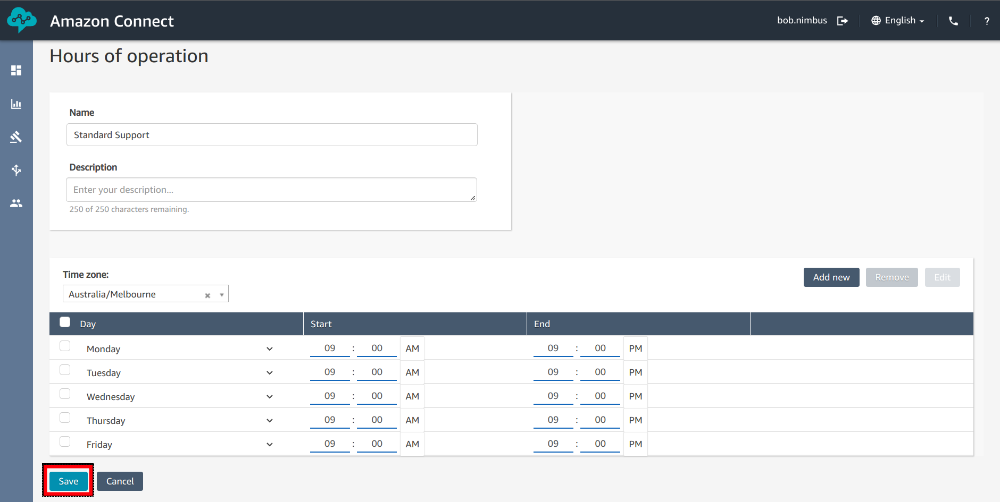

### Creating a Queue
Once we've got our Hours setup we can now setup our queue. To start, we need to open the "Queue" portal, by selecting it from the "Routing" menu on the left hand side.

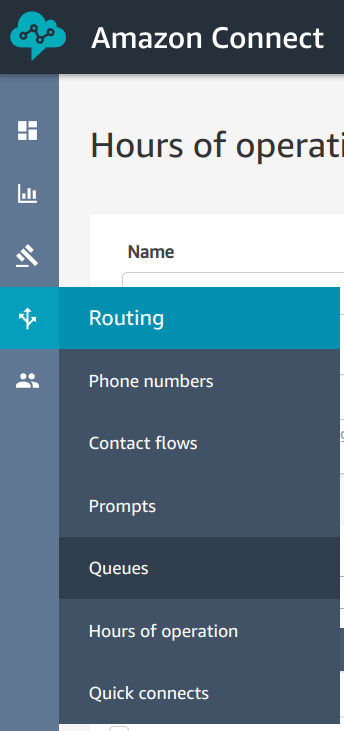

Next, we need to create a new queue, by clicking the "Add new queue" button on the right hand side of the page.

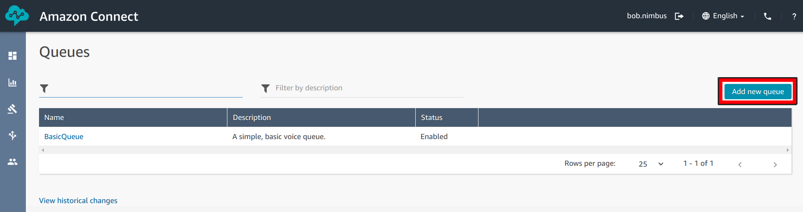

While it might look a little scary, we don't actually need to worry about a lot of the options on this page, given what we are looking to do with this queue. To start, we need to name it "Support", we need to select "Standard Support" from the "Hours of operation" drop-down menu and that's it. We don't need to worry about any of the outbound settings given we are only focused on inbound calls for the time being. 

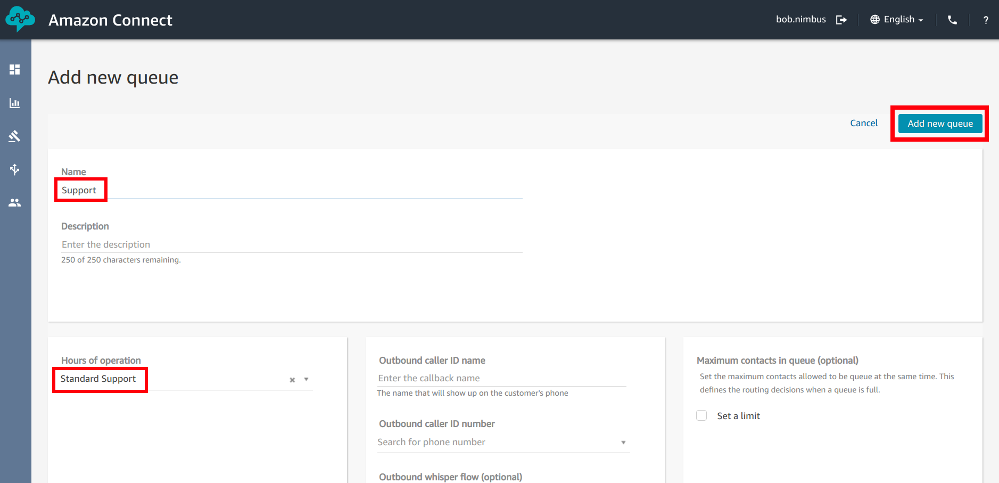

And that's it... we now have a support queue with it's hours of operation configured. The next step is to configure up an agent that can answer the calls. While we could answer calls using our Admin user... we really should be using least privilege practises. But before we create a new user, we will need to create a routing profile

### Creating a Routing Profile
A routing Profile is a set of rules that define how an agent can interact with the Amazon Connect instance and which queues that can partake in.

Given the simple nature of our Instance at the moment we will simply create a profile that just subscribes the agent to the "Support" queue we've just made. To do this we need to open the "Routing Profiles" page which can be found under the "Users" menu on the Left hand side.

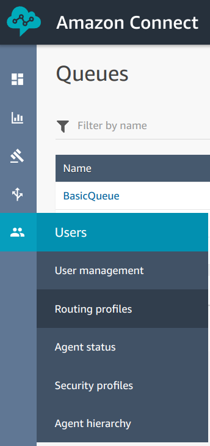

Once there we need to "Add new profile" by clicking the button on the right hand side.

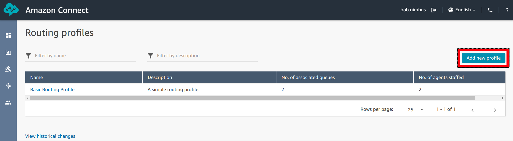

As this profile will only be supporting a single queue, we'll go ahead and call it "Support Profile", check the "Voice" check box under "Set channels and concurrency" so the agent can receive inbound calls... and add select the support queue from the drop-down under "Routing profile queues".

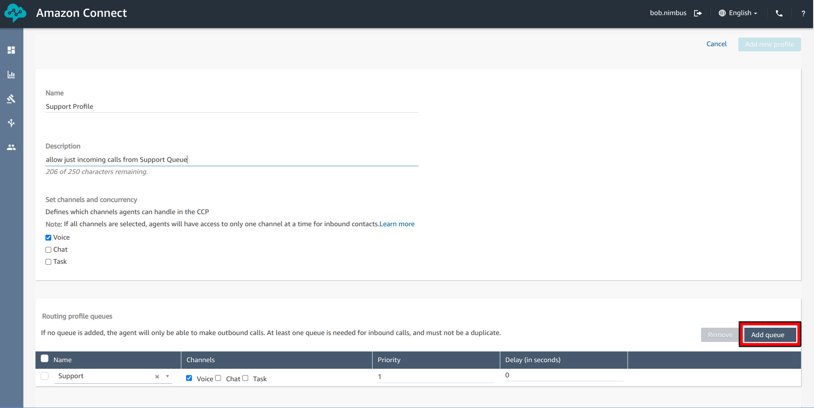

scrolling down the page, and we need to select an "outbound Queue" even though we are not using outbound services. For our example we can just select "BasicQueue" from the list

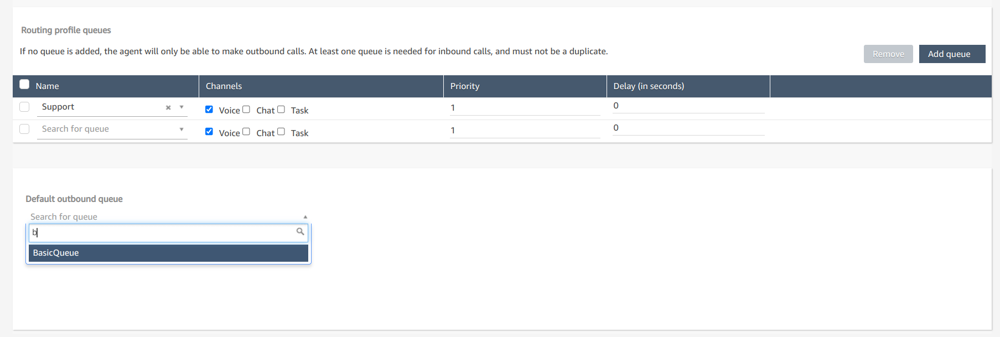

Once that's done, scroll back up to the top of the page and click on the "Add new profile" button.

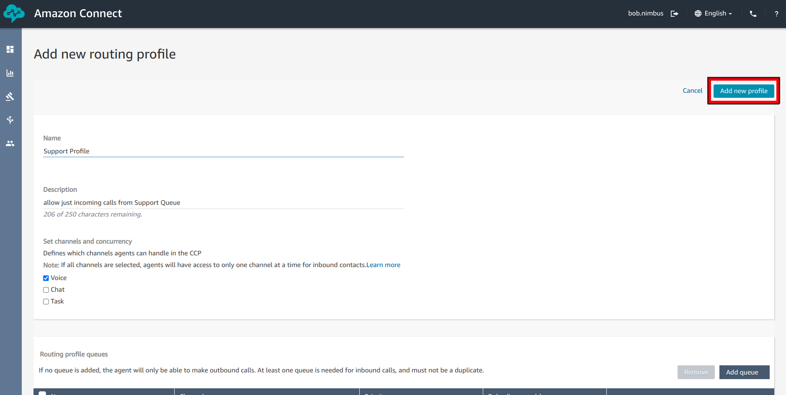

### Creating an Agent Login
For the purposes of testing we will need to create an agent user so that we can test our queue functionality.

To create a new user for our Instance, select "user management" from the "Users" menu located on the left hand menu.

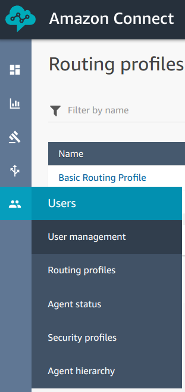

Next, click the "Add new users" button located on the right hand side.

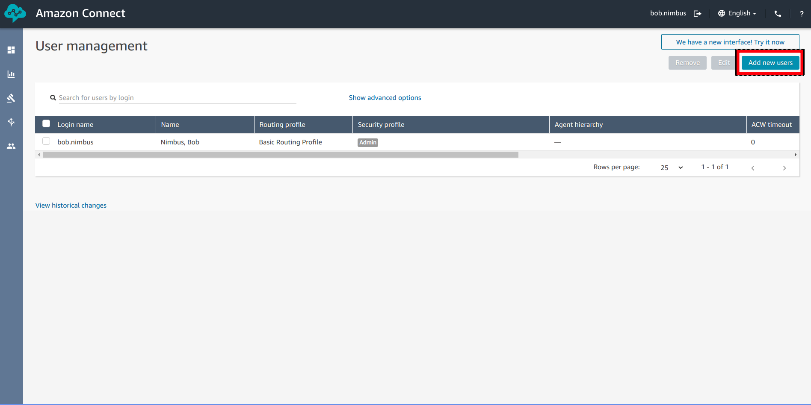

Here we want to "Create and set up a new user", the click "Next".

 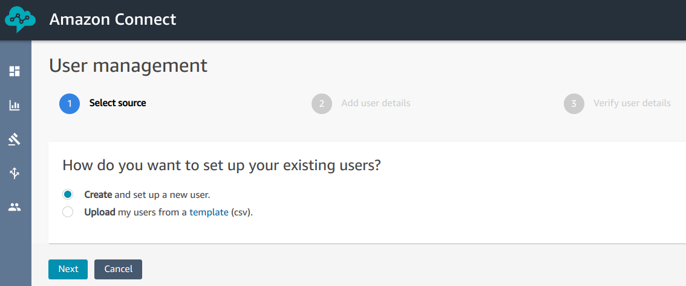

The we want to provide some details about our agent. We'll go ahead and call them "Jane Agent". So we'll need to populate her details, provide a password, a username (which for our example will just be "Jane.Agent"... taking note of the capitals as they DO matter) and an email address.

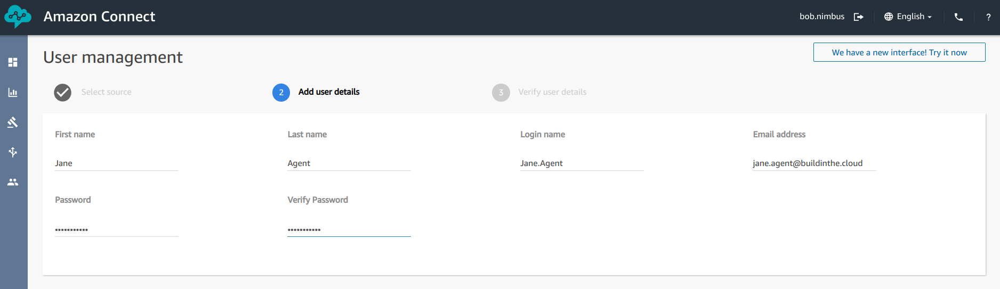

Once we've finished populating the personal details, next step is to define the Routing and Security profiles that will be applied to Jane's account.

For the "Routing Profile" we can go ahead and select the profile we just made, and for her security profile we can just go ahead and select "Agent". Once we've made those selections, we can go ahead and save the user by click "Save" at the button of the page.

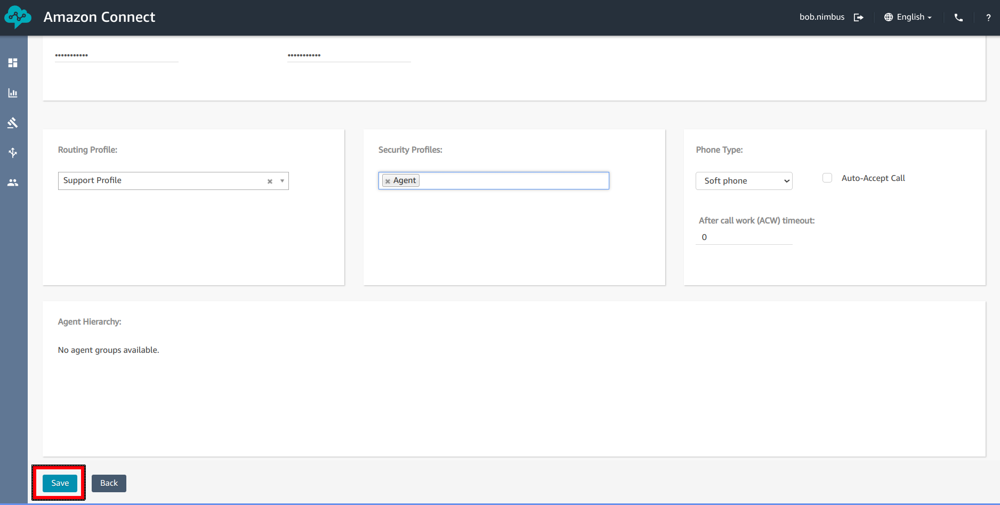

Next, we get presented with a verification page... we can just go ahead and click "Create users" (It's easy to think you've finished given the design of the page, but you haven't finished creating the users yet).

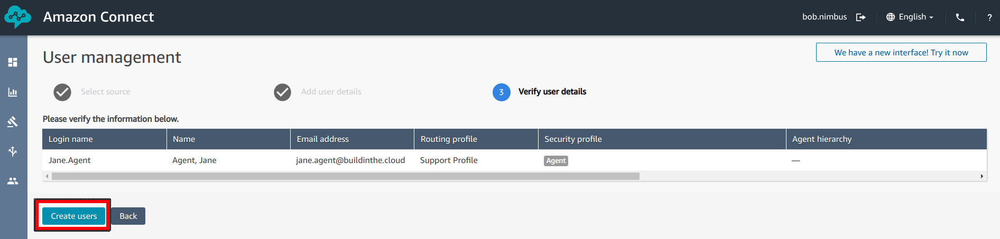

And now we're done. We have an agent user, who's been allocated the appropriate Routing Profile and security Profile. Next we need to update our Contact Flow to direct callers into our "Support" queue which we'll do in the next section.

## Updating our Contact Flow to handle agent interactions
We've got our queue and our agent, time to add it all to our contact Flow so we can start servicing callers.

First things first, we need to open our existing "Contact Flow" that we previously created which we can find on the "Contact Flows" page located under "Routing" in the land hand menu.

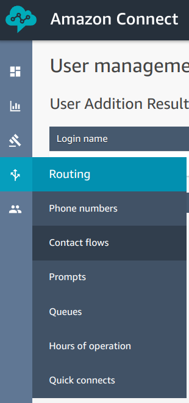

Next, we can go ahead and click on our "Initial Flow" "Contact Flow" from the table to open it up again.

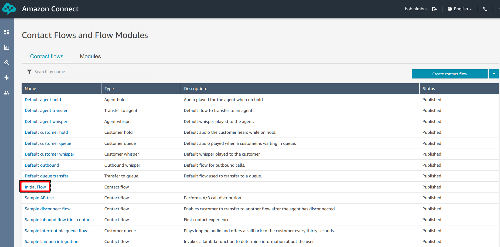

Here we are going to want to make a couple of changes:
1. we can remove the "Wait" Block.
2. we want to add a "Set working queue" block from under the "Set" menu.
3. And we want to add a "Transfer to queue" block from under the "Terminate/Transfer" menu.

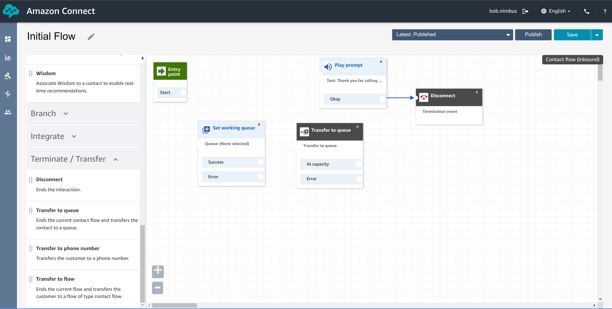

Once that's done, we need to wire it all up. The flow we are looking for is:
1. Customer calls our 1800 number and it hits this "Contact Flow"
2. We play a "Thank you for Calling Phoney Bank" message to let them know they've dialled the right number.
3. We want to set the "Queue" we are going to use to be "Support" (in a production system we'd have a IVR that would direct callers to different queues based on their selections).
4. We then want to transfer the call from the "Contact Flow" to the "Support Queue".

We can get this flow by re-arranging and wiring up the various blocks as shown below:

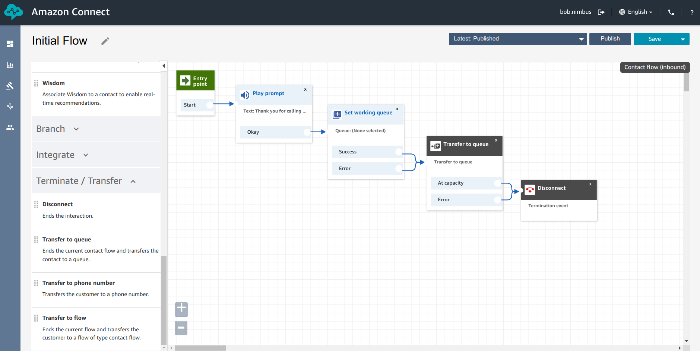

We then just need to configure the properties for each block the way we want it (remembering that we just need to click on the blocks title to open the properties page). For the "Play Prompt" block we can again use the "Text to Speech" feature

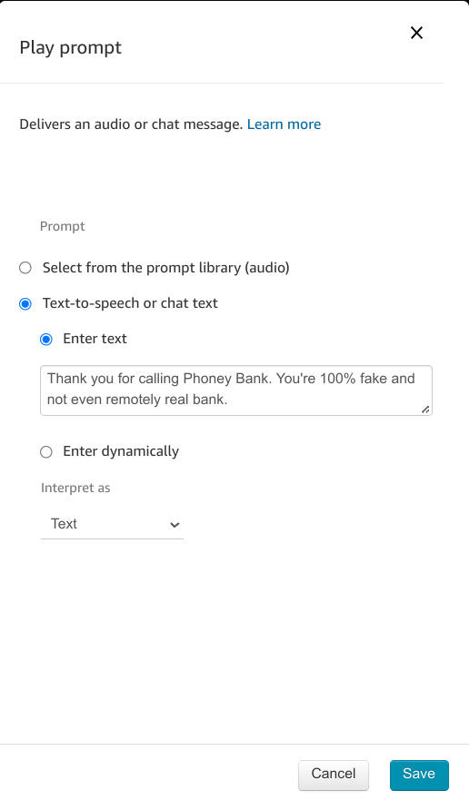

And for the "Set working queue" block, we can just select the "Support" queue from the drop-down list.

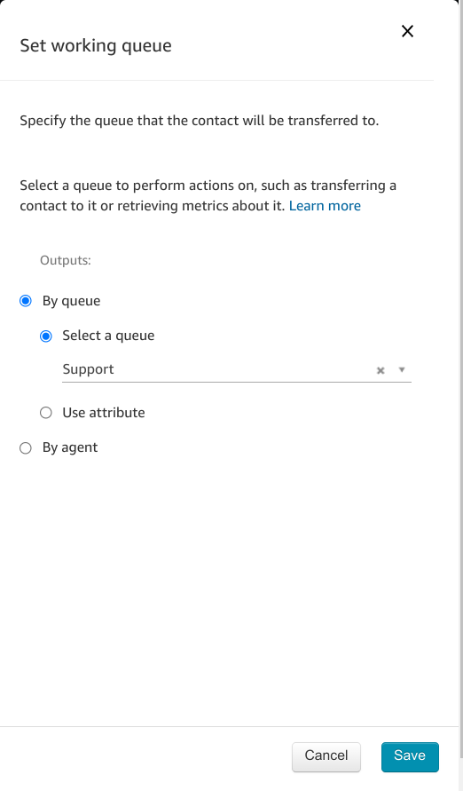

and before you know it, we have a re-configured "Contact Flow" that will direct callers to our "Support" queue after playing them a welcome message. To put this flow into production all we need to do is click on "Save" and then "Publish" (remembering to accept both the pop-ups).

Now all we need to do is to get our agent to log-in to the Agent Control Panel and make themselves available to accept incoming calls. We'll take a look at the agent control panel in the next section.

## The Agent Application
Time for us to pretend we are Jane Agent and start fielding some support calls. To do this we are going to need to log into our Amazon Connect Instance using the credentials we created earlier.

To start with, open yourself an Incognito window and browse to the access URL of your connect instance. You can find this in the address bar of your browser window from the last section. It will be your Instance alias followed by .my.connect.aws (for my example it's phoneybank-1234.my.connect.aws). But before we load the page we want to prepend /agent-app-v2/ to the end of the address. So in my example I want to browse to https://phoneybank-1234.my.connect.aws/agent-app-v2/

You should be presented with the same login page we where presented with earlier in the workshop.

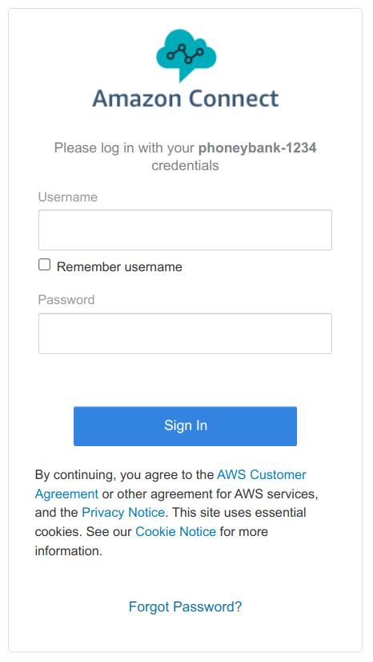

Login with Jane's credentials (remembering the capitals in the username do matter). Once you've logged in you should be presented with the Amazon Connect Agent Application as shown below.(Note, at some stage depending on your browsers security setting when browsing the Agent Application you will be presented with a request to use your computers microphone. You want to accept this request as the Agent Application will act as a soft phone and will need access to your microphone to do so).

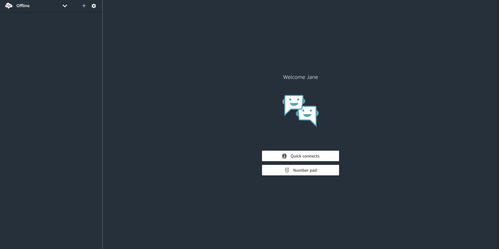

For the moment, all we are interested in is the "Off-line" drop-down in the top left of the page. We want to go ahead and click on it and select "Available" from the drop-down. This will make it so we can accept calls coming into the queue.

Once we've done this, using your mobile phone you can go ahead and dial your Instance's Toll-Free number (the one we provisioned earlier) and after a moment you should hear the welcome message being played by the "Play Prompt" in your "Contact Flow". After a moment or two more, you should hear a second prompt and at the same time see the call coming in on your Agent Application. (I've blanked out the incoming phone number for obvious reasons). You can go ahead and click "Answer call" to pick it up and start talking to yourself. If you are listening to your computer, you would have heard it say "Support" first. This is in case the agent is servicing multiple queues, they can know which one the call has come through.

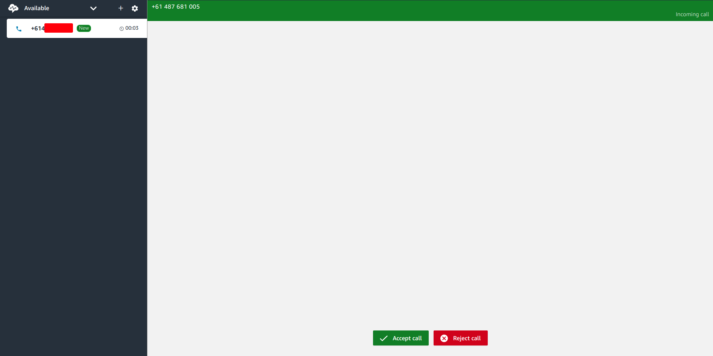

And that's it, we can now take calls from customers ringing into our Toll-Free number. While we didn't explicitly set it up, we also have on hold music, waiting prompts and an array of other features making this a valid 0.1 version of Phoney Bank's new Contact Centre.

## Conclusion
So we have a Toll-Free number and we can accept calls from customers and patch them through to agents waiting to answer their questions. But what we now want to do is add some security around how we might verify who they are which will be important if we want to talk to them about their specific accounts with us. In the next section we'll add some security by Introducing Voice ID to our "Contact Flow" so we can start registering callers and identifying them off their voice Print.

Proceed to the next section [here](Part4.md)