# Authenticating Users with Amazon Voice ID
## Introduction
With our incoming phone number and queue systems now working as we'd expect, it's time we moved our focus from setting up the core functionality onto setting up some authentication and identification mechanisms so we know which customer we are talking to.

In this section we'll take a look at Voice ID, a feature of Amazon Connect that uses machine learning to provide real-time caller authentication and fraud risk detection. We'll go through the tasks needed to set Voice ID up as well as how we can integrate it into our Contact Flow and start identifying customers with it.

## I look into Voice ID Domains
The first thing we need to do it to setup a Voice ID domain. what is a Voice ID domain you ask? Well, a Voice ID domain is simply a container (not a docker container) that stores all of the data generated and used by Voice ID including voice Prints, enrolment status, speaker identifiers and other meta data.

It's important to note a couple of key guidelines when creating Amazon Connect Voice ID domains:
- Each Amazon Connect instance can be associated with only one Voice ID domain.
- Each Voice ID domain can be associated with multiple Amazon Connect instances. This enables you to use the same stored customer data across multiple Amazon Connect instances.
- You can create multiple domains, but they don't share customer data between each other.
- AWS recommend creating new Voice ID domains to associate with an Amazon Connect instance when:
  - You are enabling Voice ID for the first time on your account in an AWS region.
  - You want to ensure that you isolate the Voice ID domains used for your test and production environments
- AWS recommend using an existing Voice ID domain when:
  - You want to use the same set of enrolled callers and fraudsters across different Amazon Connect instances (that may belong to different customer service teams)
  - You want to use the same test environment across different test Amazon Connect instances.

If you want more information about Amazon Connect Voice ID you can visit the documentation page here https://docs.aws.amazon.com/connect/latest/adminguide/voiceid-domain.html

Based on these recommendations, we will need to create ourselves a brand new Voice ID Domain given that  this is the first for our AWS account.
## Provisioning our Voice ID Domain
To provision a new Amazon Connect Voice ID Domain, we first need to visit our Amazon Connect Instance page within the AWS Management Console (not to be confused with the Instance portal we've been using thus far throughout the workshop). We can get to the management console by browsing to https://ap-southeast-2.console.aws.amazon.com/connect/v2/app/instances?region=ap-southeast-2 (assuming your using the Sydney Region) and clicking on the "Instance alias" link for our Instance.

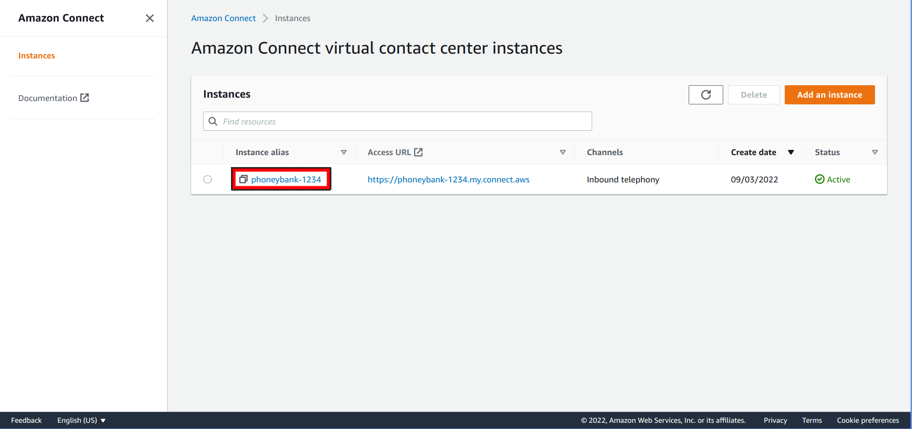

Next, we want to click on "Voice ID" listed in the menu on the Left hand side of the Page.

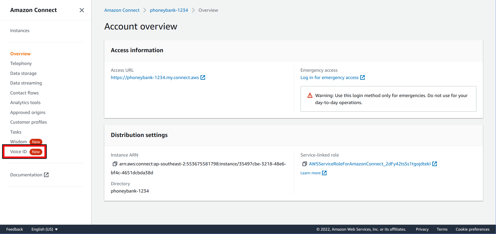

Once you've accepted the BIPA terms, we can progress with setting up the Domain. As we are creating a new Domain, the first thing we need to do is give our domain a name. For our example we'll go with "au_customers".

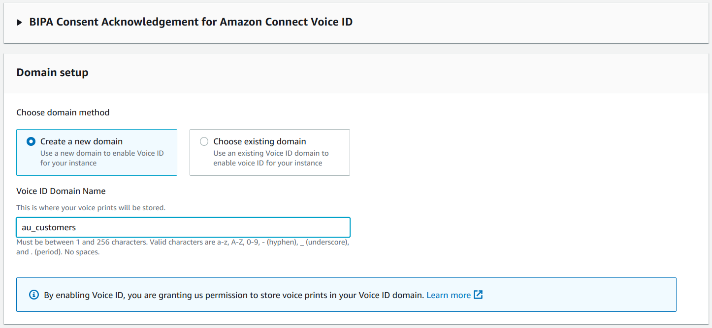

Next, we need to configure up an Amazon KMS key. As this domain will be storing a lot of sensitive information it's best if we encrypt it. For simplicity sake, we can just go ahead and click on "Create an AWS KMS key" which will open a new window

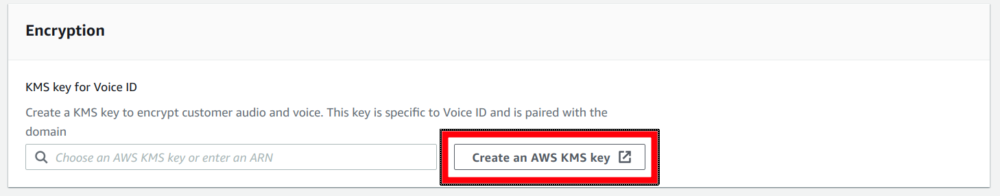

Under the KMS service, given this is only a POC we can pretty much just accept the defaults here. For the "Key Type" we can leave it on "Symmetric" and click "Next" (we don't need to configure any of the advanced options).

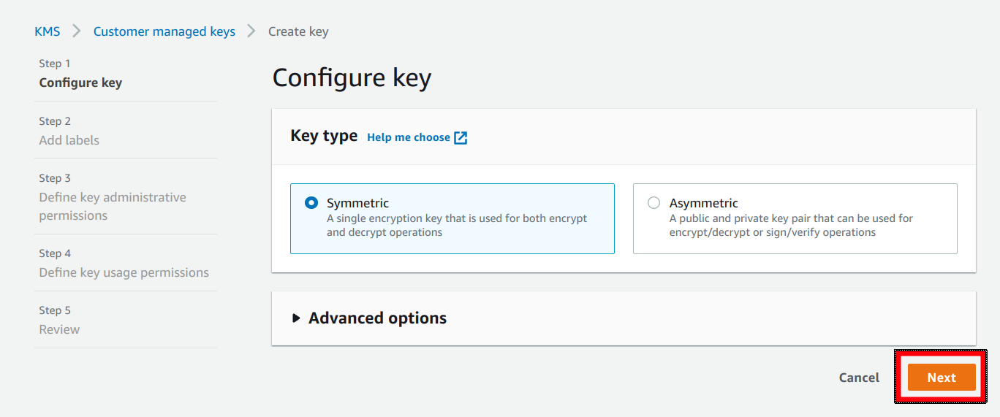

for the "Alias" we can go with "voice_id_au_customers", and we can go ahead and leave the rest blank and click "Next".

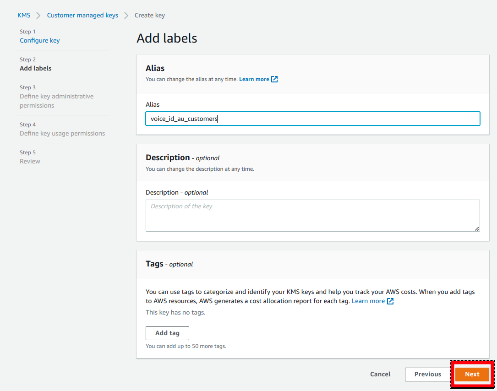

For "Key Administrators" we can just go ahead and leave that as is and click "Next"

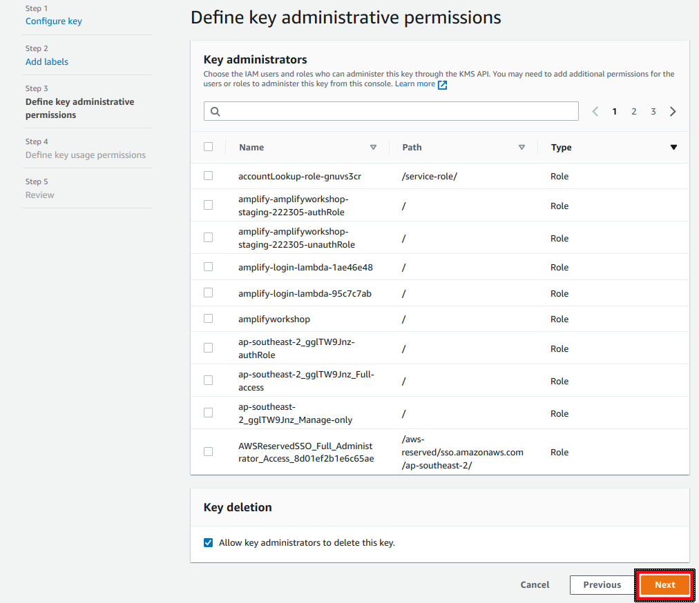

On the "Define key usage permissions" page, again we can just leave it as it is and click "Next" again.

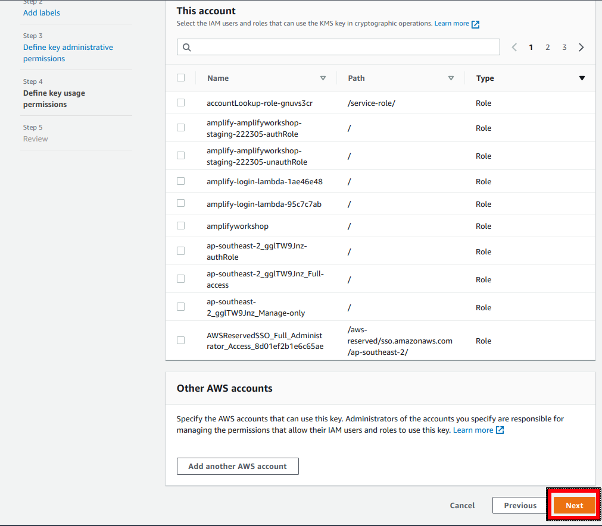

and then finally, on the "Review" page... simply go ahead and click "Finish".

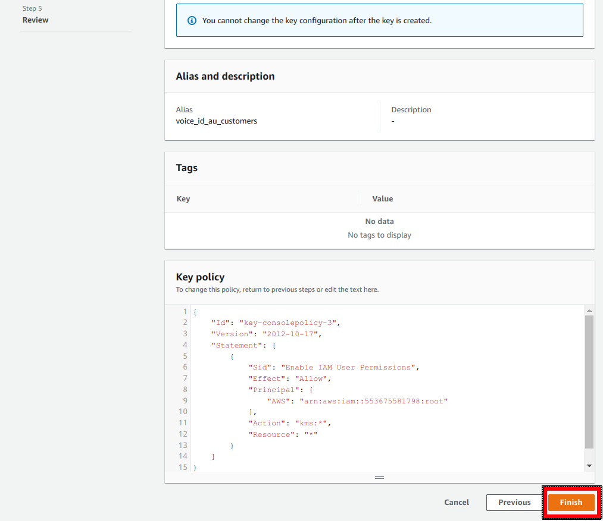

we can go ahead and close that window and return back to our Connect Portal where we should now be able to select our "voice_id_au_customers" key from the drop-down list. Once we do that, we can go ahead and "Enable Voice ID"

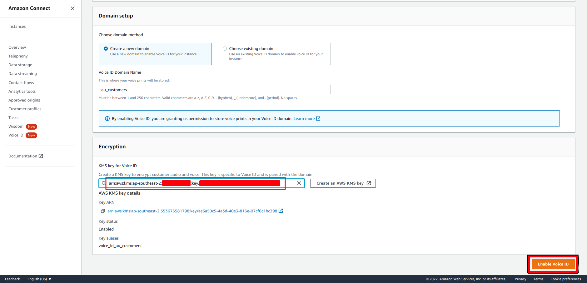

After a moment we should get our Voice ID domain listed with a state of "Active".

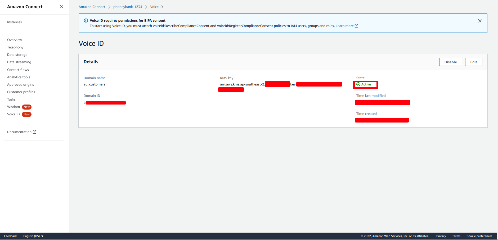

And we now have our Voice ID Domain configured and ready for use by our Connect Instance.

## Integrating Voice ID to our Contact Flow
Now that we've enabled Voice ID within our Amazon Connect Instance, the next step is to integrate it to our Contact Flow.

There is a lot to setup here so to make life a little easier I've created an export of the completed "Contact Flow" that you can just go ahead and download. it's located within the repository for this workshop https://github.com/mattmerriel/Connect_Workshop_4/blob/main/InitialFlow.flow

Back in our Amazon Connect Instance Portal (Not the AWS Management Console) If we browse back to our "Initial Flow" "Contact Flow" by again select "Contact Flow" from the "Routing" menu on the Left hand side of our Amazon Connect URL we can leverage the beta import flow feature AWS have recently added to the "Contact Flow" page.

Clicking on the little down arrow next to the "Save" button, we can select "Import flow (beta)" as shown below

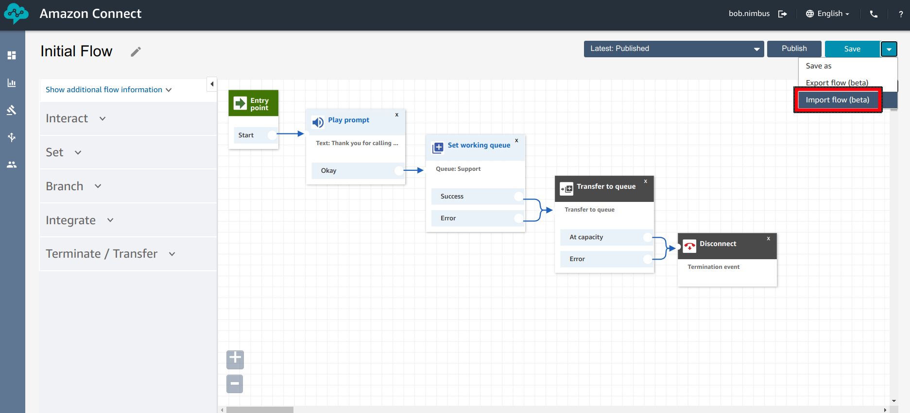

From here we can click on the "Select" button and locate the "InitialFlow.flow" file you've downloaded. Once you've selected it, go ahead and click "Import"

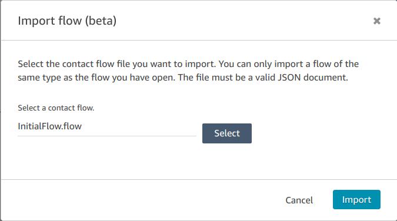

and just like a bought one, we have our updated "Contact Flow" complete with Voice ID integration. Make sure you go ahead and click "Save" and then "Publish" to make sure that it's setup as the current, in use version of the "Initial Flow".

IMPORTANT NOTE: you might notice that we have hard coded the "CustomerID" to 0010001 (you can see this in the "Set Contact Attributes" block. This is because for the purposes of this workshop we are skipping over the task of integration into a CRM and doing a customer details data-dip. This does mean that this solution will assume every caller is the same person but will fill our needs for the purposes of testing.

Now we only need to do one more things before we can use this in the wild and that's giving our Agents access to the Voice ID system which we'll take care of in the next section.
## Providing Agents access to Voice ID data
All we have left to do before we can test our solution is to give our "Agent" security Profile the permission it's going to need to be able to access the Voice ID data when using the Agent Application.

We can do this via the "Security Profiles" section under "Users" located in the menu on the Left hand side of the Instance portal.

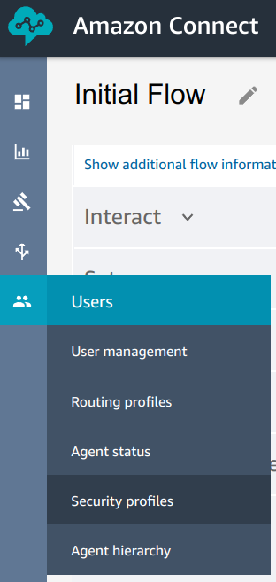

From  here we need to open up the "Agent" profile by simply clicking on it's name from the table.

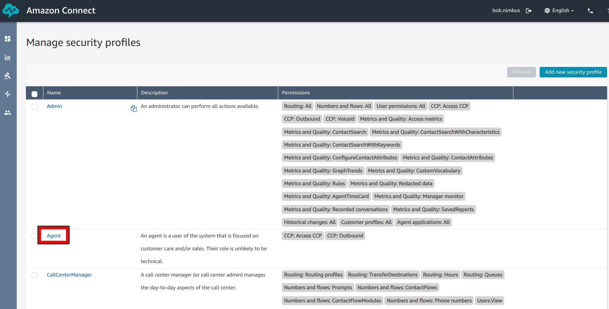

On this screen we can control all of the different components that users assigned this profile have access to. For our purposes, all we are interested in is the "Contact Control Panel (CCP) section which should have three items listed below it. We want to make sure that "Voice ID" is checked and check it if it's not. Once we do that, we can go ahead and click on "Save".

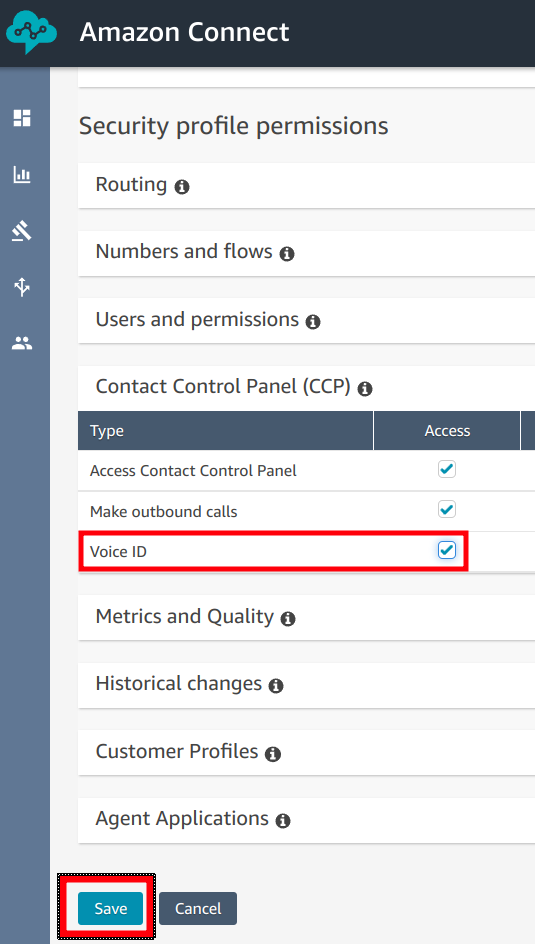

and that's it, if the agents all log out of the Agent Application, when they log back in they will have access to the Voice ID data which we will test in the next section.

## Testing our Voice ID Solution
Well, we are at the point now where we can test our Voice ID implementation and make sure that it can enroll calls and identify their voice print.

Firstly, we want to log back into the agent portal using the same URL we used earlier when testing our Agent Queue (by visiting the url https://instancename.my.connect.aws/agent-app-v2/ where instance name is the alias you defined for your instance). Once you've logged back in as Jane, set yourself to available, and you are now ready to accept a call and enroll them into the Voice ID system.

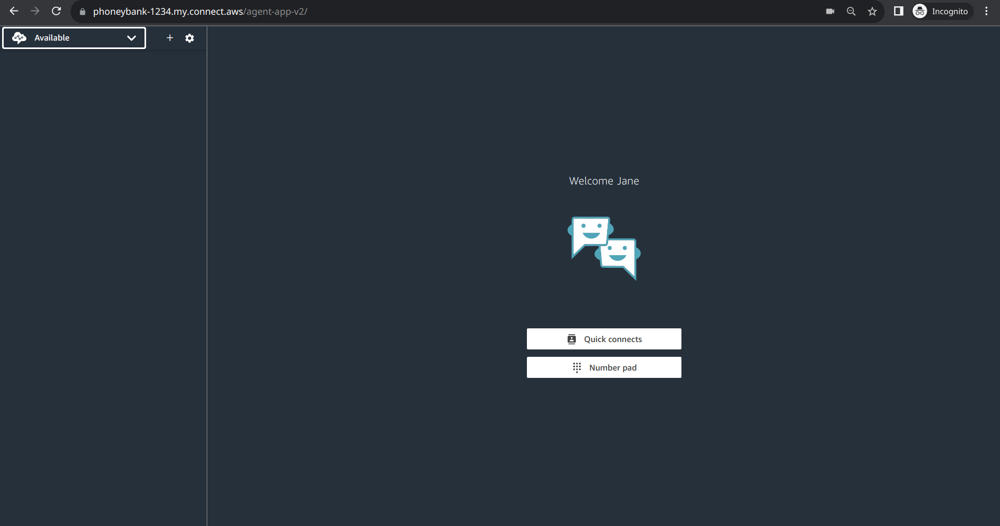

Now, call into your contact centre from your mobile phone and after getting to the IVR you will be asked to explain the reason for your call. For the purposes of testing, you can just talk to the machine for 10 seconds or so after which you should be told your not enrolled in Voice ID (which shouldn't be a surprise) and be directed to a customer agent. Once you as the agent answers the call you should notice a new section of the page appear and the option to enroll the user's Voice ID. Go ahead and click the button!

Once you click the button you should see the system start to take a Voice print of the caller. Now the caller will need to talk in their normal voice for a period of 30 seconds. In normal operation the agent would simply go through the process of helping the caller solve their enquiry, but for testing you can simply just talk into your phone.

depending on how varied your speech is and how many times you repeat words you may need to talk for a while, but as you can see from the below screenshot it took just after a minute for it to capture and blueprint my voice (a minute 13 by the time I put down the phone and took a screenshot).

At this point you can hang up the phone and complete the transaction on the agent side as we've confirmed that Amazon Connect can capture out voice print.

But can it use it to our advantage? Well, we can test this by calling in again and speaking for 10 seconds at the IVR.

In addition to getting a different message before being forwarded to the queue, you should also now be able to see that the caller has been authenticated meaning that the system has been able to match the voice to the print it has on file.
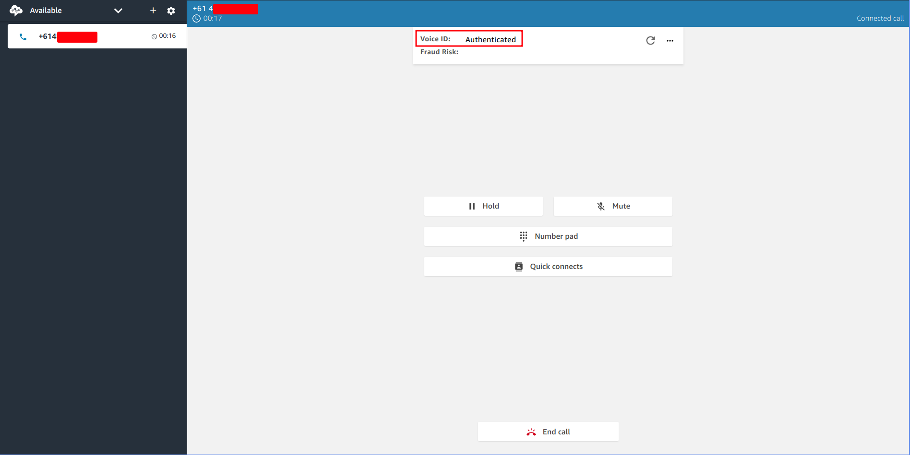

And that's it. We can now identify people's voice prints and use it to verify their identity within an Amazon Connect "Contact Flow". 

## Conclusion
Obviously there would still be a bit of work involved in getting this example to a fully production ready state (not the least of which would be integration into a CRM/ERP for customer ID lookup). But from what we've walked through it should give you a basic understanding of how you can leverage Voice ID to provide an additional level of verification to caller interactions.

With this in mind it's time to move our focus onto the next step in building out our Contact Centre solution and that's enabling our Agents to lookup support material so that they can better serve our customers now that we know who they are.

Proceed to the next section [here](Part5.md)